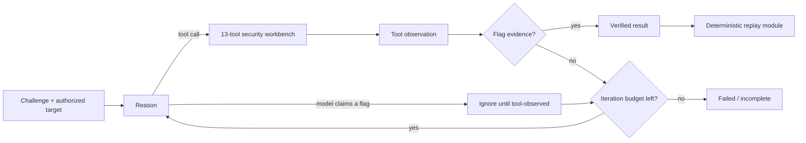

<div align="center">


# OtomenTiga Agentic CTF Harness

**The Champion project from UCSI Agentic AI CTF 2026 — rebuilt as an evidence-driven, replayable agent system.**

[](https://github.com/H0l3yM0l3h/OtomenTigaUCSI-AI-Agent/actions/workflows/ci.yml)


**9 captures · 8 deterministic replay modules · 13 agent tools · 4 model providers**

[Quick start](#quick-start) · [Architecture](#the-agentic-loop) · [Capture portfolio](#capture-portfolio) · [Deep dive](docs/architecture.md) · [Writeups](docs/writeup.md)

</div>

---

## Why this is more than an LLM wrapper

OtomenTiga gives a reasoning model a real security workbench: file inspection, binary analysis, Python execution, TCP interaction, HTTP requests, concurrency, and transformations. LangGraph keeps the model inside a bounded **reason → act → observe → verify** loop.

The critical invariant is simple:

> **A flag-shaped model answer is never accepted as a capture. The run succeeds only after an executed tool returns flag evidence.**

That separates a convincing answer from a defensible result. The harness also preserves successful techniques as deterministic replay modules, so a discovery can become repeatable engineering evidence.

| Production concern | What the harness does |
|---|---|
| Evidence integrity | Accepts flags from `ToolMessage` observations only; model-only claims are ignored. |
| Bounded autonomy | Enforces a configurable reasoning limit and explicit terminal states. |
| Reproducibility | Keeps autonomous discovery separate from deterministic challenge replay. |
| Operational readiness | Ships a no-network environment doctor, meaningful exit codes, JSON output, tests, and CI. |
| Portability | Uses one provider interface for OpenAI, Anthropic, Ollama, and Groq. |
| Execution reliability | Uses the active Python environment, unique run files, quoted argument parsing, time limits, and output caps. |
| Honest failure | Missing assets, expired services, and unverified output return failure—not a previously known flag. |

## The agentic loop



The model chooses the next action; LangGraph executes the selected tool; the observation returns to the state machine. Before another model call, the evidence gate scans tool observations for the competition flag format. This prevents the LLM from self-certifying a hallucinated result.

The structured run result includes a run ID, status, flags, evidence source, iterations, provider, model, category, and duration—ready for terminal use or automation.

## Quick start

### 1. Install

```bash
git clone https://github.com/H0l3yM0l3h/OtomenTigaUCSI-AI-Agent.git
cd OtomenTigaUCSI-AI-Agent
python -m venv venv
```

Windows PowerShell:

```powershell
.\venv\Scripts\Activate.ps1
python -m pip install --upgrade pip
python -m pip install -r requirements.txt
Copy-Item .env.example .env
```

Linux or macOS:

```bash
source venv/bin/activate
python -m pip install --upgrade pip
python -m pip install -r requirements.txt
cp .env.example .env
```

### 2. Diagnose before you run

```bash
python run.py doctor
```

`doctor` performs a no-network audit of Python, core packages, the configured provider integration, replay modules, native tools, and bundled challenge assets.

For CI or scripts:

```bash
python run.py doctor --json
python run.py challenges --json
```

### 3. Configure a reasoning provider

The default OpenAI profile uses `gpt-5.6-terra` with the Responses API and medium reasoning effort. Any supported provider/model can be selected in `.env` or overridden at runtime.

```dotenv
LLM_PROVIDER=openai
LLM_MODEL=gpt-5.6-terra
OPENAI_API_KEY=your-key
MAX_ITERATIONS=25
```

Local smoke test with Ollama:

```dotenv
LLM_PROVIDER=ollama
LLM_MODEL=qwen3
OLLAMA_BASE_URL=http://localhost:11434
```

Small local models are useful for workflow testing, but may respond without selecting a tool. Difficult autonomous exploitation benefits from a stronger tool-calling model; `doctor` warns when a very small local model is configured.

### 4. Launch an authorized solve

```bash
python run.py solve \
  --challenge "Inspect this service, identify the vulnerability, and capture the flag" \
  --category web \
  --host TARGET_HOST \
  --port TARGET_PORT \
  --max-iterations 25
```

File-based challenge:

```bash
python run.py solve \
  --challenge "Analyze the supplied binary and capture the flag" \
  --category pwn \
  --files ./challenge/vuln ./challenge/libc.so.6
```

Machine-readable result:

```bash
python run.py solve --quiet --json --challenge "..." --category web
```

## Two execution tracks

### Autonomous discovery

Use `solve` when the attack path is unknown. The agent inspects evidence, chooses tools, executes actions, adapts to observations, and stops only on tool-observed evidence or a bounded terminal condition.

### Deterministic replay

Use `solver` when a successful technique has already been captured. Replay does not require an LLM and returns a non-zero exit status if the target is offline, an asset is missing, or no flag is observed.

```bash
python run.py solver saturn-exchange
python run.py solver grimoire-heap
```

This separation is intentional: **the agent discovers; the replay module preserves.**

## Capture portfolio

The competition portfolio contains nine captures across web, PWN, and firmware challenges. Eight have importable replay modules; Helios is retained as a documented capture without pretending that a replay module exists.

| # | Challenge | Domain | Technique | Repository evidence |
|---:|---|---|---|---|
| 1 | Grimoire Heap | PWN | UAF + tcache poisoning | Replay solver |
| 2 | Sandworm VM | PWN | VM out-of-bounds escape | Replay solver |
| 3 | Saturn Exchange | WEB | Asynchronous settlement race | Replay solver |
| 4 | Pony Express 500 | WEB | Handlebars AST injection | Replay solver |
| 5 | Temporary | WEB | Path traversal + template injection | Replay solver |
| 6 | OldStock Router | FIRMWARE | SquashFS extraction + backup leak | Replay solver |
| 7 | StaffDesk | WEB | GraphQL IDOR + account reset | Replay solver |
| 8 | Cerberus Reports | WEB | Java deserialization + SUID pivot | Replay solver |
| 9 | Helios Metadata Broker | WEB | Redirect SSRF + IMDS credential pivot | Verified writeup |

Inspect the canonical registry:

```bash
python run.py challenges
```

See [the challenge writeups](docs/writeup.md) for the exploit chains and root-cause fixes.

## Security workbench

| Area | Tools |
|---|---|
| Binary analysis | `analyze_binary`, `list_functions`, `get_strings`, `checksec` |
| Code execution | `execute_python_code`, `execute_script_file` |
| Network | `tcp_connect_and_interact` |
| Web | `http_request`, `concurrent_requests` |
| Files and transforms | `read_file`, `write_file`, `hex_encode`, `hex_decode` |

The default code executor is a **bounded local subprocess**, not a hardened sandbox. It uses a unique temporary script, the active virtual-environment interpreter, a maximum timeout, captured output, and cleanup. The experimental Docker component is separate and is not silently presented as part of the default path.

## Industrial verification

The repository is checked on Python 3.11 and 3.12 for every push and pull request.

```bash
python -m pip check
python -m compileall -q agent solvers run.py tests
python -m unittest discover -s tests -v
python run.py doctor
```

The test suite covers the evidence gate, model-only flag rejection, flag deduplication, challenge-registry integrity, solver imports, honest failure behavior, CLI JSON contracts, and code-execution argument handling.

## Project layout

```text
.
├── run.py                     # CLI and machine-readable contracts
├── agent/
│   ├── core.py                # LangGraph orchestration + evidence gate
│   ├── challenges.py          # Canonical capture/replay registry
│   ├── diagnostics.py         # No-network environment doctor
│   ├── llm.py                 # Provider abstraction
│   ├── prompts.py             # Category-aware operating policy
│   └── tools/                 # 13 callable security tools
├── solvers/                   # 8 deterministic replay modules
├── tests/                     # Automated reliability and evidence tests
├── docs/
│   ├── architecture.md        # Engineering deep dive
│   └── writeup.md             # 9 challenge writeups
└── .github/workflows/ci.yml   # Python 3.11/3.12 verification
```

## Competition artifacts

The agent harness is the active engineering focus. The original competition [PowerPoint deck](presentation/OtomenTiga_CTF_Agent_Competition_Deck.pptx) and [browser presentation](presentation/index.html) remain available as separate artifacts.

## Responsible use

This project is for CTFs, education, and explicitly authorized security testing. Do not point it at systems you do not own or have permission to test. Remote replays also depend on the original competition infrastructure remaining available.

---

<div align="center">

**Reason. Act. Prove. Replay.**

Built by **Team OtomenTiga** — UCSI Agentic AI CTF 2026 Champion project.

</div>
