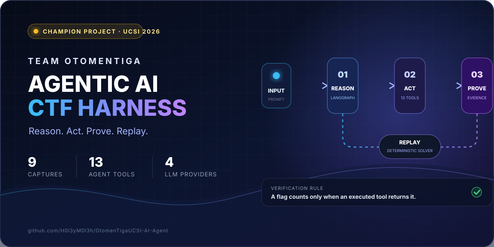
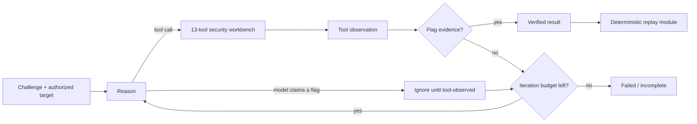
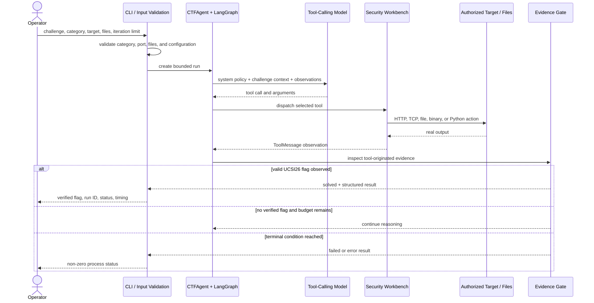
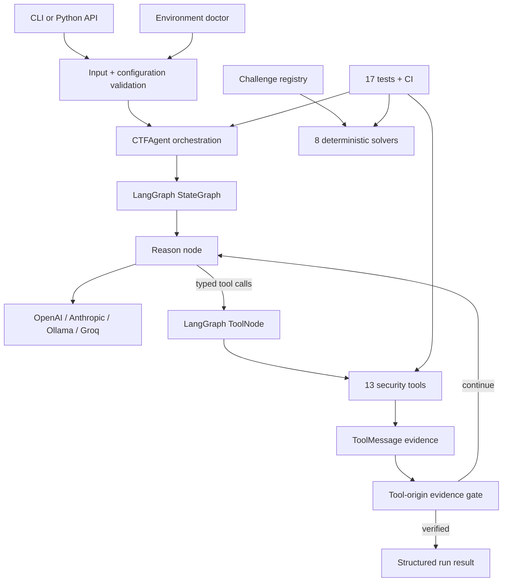

<div align="center">



# OtomenTiga Agentic CTF Harness

**The Champion project from UCSI Agentic AI CTF 2026 — rebuilt as an evidence-driven, replayable agent system.**

[](https://github.com/H0l3yM0l3h/OtomenTigaUCSI-AI-Agent/actions/workflows/ci.yml)


**9 captures · 8 deterministic replay modules · 13 agent tools · 4 model providers**

[Workflow](#complete-live-solve-workflow) · [Harness](#harness-architecture) · [Tech stack](#technology-stack) · [Quick start](#quick-start) · [CLI](#cli-reference) · [Capture portfolio](#capture-portfolio) · [Deep dive](docs/architecture.md) · [Writeups](docs/writeup.md)

</div>

---

## Why this is more than an LLM wrapper

OtomenTiga gives a reasoning model a real security workbench: file inspection, binary analysis, Python execution, TCP interaction, HTTP requests, concurrency, and transformations. LangGraph keeps the model inside a bounded **reason → act → observe → verify** loop.

The critical invariant is simple:

> **A flag-shaped model answer is never accepted as a capture. The run succeeds only after an executed tool returns flag evidence.**

That separates a convincing answer from a defensible result. The harness also preserves successful techniques as deterministic replay modules, so a discovery can become repeatable engineering evidence.

| Production concern | What the harness does |
|---|---|
| Evidence integrity | Accepts flags from `ToolMessage` observations only; model-only claims are ignored. |
| Bounded autonomy | Enforces a configurable reasoning limit and explicit terminal states. |
| Reproducibility | Keeps autonomous discovery separate from deterministic challenge replay. |
| Operational readiness | Ships a no-network environment doctor, meaningful exit codes, JSON output, tests, and CI. |
| Portability | Uses one provider interface for OpenAI, Anthropic, Ollama, and Groq. |
| Execution reliability | Uses the active Python environment, unique run files, quoted argument parsing, time limits, and output caps. |
| Honest failure | Missing assets, expired services, and unverified output return failure—not a previously known flag. |

## The agentic loop



The model chooses the next action; LangGraph executes the selected tool; the observation returns to the state machine. Before another model call, the evidence gate scans tool observations for the competition flag format. This prevents the LLM from self-certifying a hallucinated result.

The structured run result includes a run ID, status, flags, evidence source, iterations, provider, model, category, and duration—ready for terminal use or automation.

## Complete live-solve workflow

This is what happens when an operator launches `python run.py solve` against an authorized challenge:



### Workflow stages

1. **Input and authorization context** — The operator supplies a challenge description, category, optional target host/port, and optional local artifacts.
2. **Preflight validation** — The harness rejects empty descriptions, unsupported categories, incomplete host/port pairs, invalid ports, missing files, and invalid iteration limits before model execution.
3. **Provider initialization** — The selected OpenAI, Anthropic, Ollama, or Groq adapter is created and bound to all 13 tools.
4. **Category-aware planning** — The model receives the master operating policy plus PWN, WEB, REV, CRYPTO, or MISC guidance.
5. **Tool dispatch** — LangGraph's `ToolNode` executes the requested tool with typed arguments.
6. **Real observation** — Tool output is appended as a `ToolMessage`; this can be target data, process output, file contents, binary metadata, or an execution error.
7. **Evidence verification** — The gate scans tool observations only. Flag-shaped model text cannot complete the solve.
8. **Bounded iteration** — The observation returns to the model until evidence is found, the model stops requesting tools, an error occurs, or the iteration budget is exhausted.
9. **Structured completion** — The CLI returns a human-readable result or JSON with a meaningful process exit code.
10. **Replay preservation** — Once a technique is stable, it can be kept as a deterministic solver that reproduces target evidence without an LLM.

## Harness architecture



| Harness layer | Implementation | Responsibility |
|---|---|---|
| Interface | `run.py` | Commands, arguments, Rich output, JSON output, and process codes |
| Orchestration | `agent/core.py` | StateGraph, reason/tool routing, limits, evidence gate, and result contract |
| Model gateway | `agent/llm.py` | Lazy provider construction and one LangChain chat-model interface |
| Operating policy | `agent/prompts.py` | ReAct methodology and category-aware instructions |
| Tool registry | `agent/tools/__init__.py` | Single registration point for all 13 callable tools |
| Execution boundary | `agent/tools/code_executor.py` | Unique scripts, active interpreter, timeouts, output caps, and cleanup |
| Portfolio registry | `agent/challenges.py` | Canonical capture metadata, aliases, evidence type, and replay mapping |
| Diagnostics | `agent/diagnostics.py` | No-network checks for runtime, providers, solvers, tools, and artifacts |
| Replay layer | `solvers/` | Challenge-specific deterministic evidence reproduction |
| Quality gate | `tests/` and GitHub Actions | Unit, integration, compatibility, and honest-failure verification |

### Agent state

The graph carries the conversation messages, challenge, category, observed flags, current iteration, maximum iterations, and terminal status. Model responses and tool observations remain distinct message types so the evidence gate can enforce provenance.

### Terminal states

| State | Meaning |
|---|---|
| `solved` | At least one valid flag was extracted from an executed tool observation |
| `failed` | The loop ended without verified evidence |
| `error` | The graph or a provider encountered an execution error |

## Technology stack

| Layer | Technology | Why it is used |
|---|---|---|
| Language | Python 3.11 / 3.12 | Portable agent, tool, solver, and automation runtime |
| Agent orchestration | LangGraph | Explicit state machine, conditional routing, and bounded tool loop |
| AI integration | LangChain | Common messages, typed tools, `ToolNode`, and provider interoperability |
| Cloud reasoning | OpenAI, Anthropic, Groq | Strong hosted tool-calling model options |
| Local reasoning | Ollama | Private, local, or self-hosted experimentation |
| Binary exploitation | pwntools | ELF interaction, payload construction, and remote process workflows |
| Binary analysis | radare2 / r2pipe, GDB, binutils | Disassembly, functions, strings, protections, and debugging when installed |
| HTTP and APIs | requests, aiohttp | Stateful requests, API exploitation, and concurrent race testing |
| Terminal experience | Rich | Tables, status panels, diagnostics, and readable evidence output |
| Configuration | python-dotenv | Local provider and runtime configuration without committing secrets |
| Testing | `unittest` | Evidence, CLI, configuration, executor, registry, and graph integration tests |
| CI/CD | GitHub Actions | Python 3.11/3.12 compile, test, dependency, and doctor verification |
| Documentation | Markdown, Mermaid, SVG | Repository-native technical documentation and architecture visuals |

## Quick start

### 1. Install

```bash
git clone https://github.com/H0l3yM0l3h/OtomenTigaUCSI-AI-Agent.git
cd OtomenTigaUCSI-AI-Agent
python -m venv venv
```

Windows PowerShell:

```powershell
.\venv\Scripts\Activate.ps1
python -m pip install --upgrade pip
python -m pip install -r requirements.txt
Copy-Item .env.example .env
```

Linux or macOS:

```bash
source venv/bin/activate
python -m pip install --upgrade pip
python -m pip install -r requirements.txt
cp .env.example .env
```

### 2. Diagnose before you run

```bash
python run.py doctor
```

`doctor` performs a no-network audit of Python, core packages, the configured provider integration, replay modules, native tools, and bundled challenge assets.

For CI or scripts:

```bash
python run.py doctor --json
python run.py challenges --json
```

### 3. Configure a reasoning provider

The default OpenAI profile uses `gpt-5.6-terra` with the Responses API and medium reasoning effort. Any supported provider/model can be selected in `.env` or overridden at runtime.

```dotenv
LLM_PROVIDER=openai
LLM_MODEL=gpt-5.6-terra
OPENAI_API_KEY=your-key
MAX_ITERATIONS=25
```

Local smoke test with Ollama:

```dotenv
LLM_PROVIDER=ollama
LLM_MODEL=qwen3
OLLAMA_BASE_URL=http://localhost:11434
```

Small local models are useful for workflow testing, but may respond without selecting a tool. Difficult autonomous exploitation benefits from a stronger tool-calling model; `doctor` warns when a very small local model is configured.

### 4. Launch an authorized solve

```bash
python run.py solve \
  --challenge "Inspect this service, identify the vulnerability, and capture the flag" \
  --category web \
  --host TARGET_HOST \
  --port TARGET_PORT \
  --max-iterations 25
```

File-based challenge:

```bash
python run.py solve \
  --challenge "Analyze the supplied binary and capture the flag" \
  --category pwn \
  --files ./challenge/vuln ./challenge/libc.so.6
```

Machine-readable result:

```bash
python run.py solve --quiet --json --challenge "..." --category web
```

## Two execution tracks

### Autonomous discovery

Use `solve` when the attack path is unknown. The agent inspects evidence, chooses tools, executes actions, adapts to observations, and stops only on tool-observed evidence or a bounded terminal condition.

### Deterministic replay

Use `solver` when a successful technique has already been captured. Replay does not require an LLM and returns a non-zero exit status if the target is offline, an asset is missing, or no flag is observed.

```bash
python run.py solver saturn-exchange
python run.py solver grimoire-heap
```

This separation is intentional: **the agent discovers; the replay module preserves.**

## Live challenge readiness

The harness performs real actions; it is not a reasoning-only demo. In autonomous mode it can send HTTP requests, open TCP connections, execute generated Python, run prepared scripts, inspect local files, analyze binaries, and issue concurrent requests against an authorized target.

| Scenario | Readiness | Requirements |
|---|---|---|
| Web/API challenge | Strongest default path | Reachable target and a reliable tool-calling model |
| Race condition | Supported | `concurrent_requests`, correct endpoint/session details, and stable timing |
| Remote PWN service | Supported with environment setup | Binary/libc artifacts, pwntools, native analysis tools, and a capable model |
| Reverse engineering | Partially environment-dependent | Local artifact plus radare2/binutils or equivalent native tools |
| Firmware | Environment-dependent | Firmware image and extraction utilities such as `unsquashfs` |
| Known captured technique | Deterministic replay | Original service or artifacts must still be available |
| Non-UCSI flag format | Requires configuration/code extension | The current verifier recognizes `UCSI26{...}` |

### What determines live success

- **Model capability:** Small conversational models may answer without selecting tools. A strong tool-calling model is the single biggest reliability factor.
- **Available tools:** The model can only act through the registered workbench. Challenges needing a browser, specialist crypto package, debugger, or custom protocol may require another tool.
- **Environment:** Native binary and firmware utilities are optional system dependencies and are reported by `doctor`.
- **Challenge context:** Useful descriptions, correct endpoints, and original artifacts materially improve the search path.
- **Iteration budget:** Difficult chains may require more than the default 25 reasoning passes.
- **Target availability:** Replay modules cannot reproduce evidence if the original competition service is offline.

The harness guarantees evidence handling and bounded execution behavior; it does not guarantee that a model will discover every exploit.

## Capture portfolio

The competition portfolio contains nine captures across web, PWN, and firmware challenges. Eight have importable replay modules; Helios is retained as a documented capture without pretending that a replay module exists.

| # | Challenge | Domain | Technique | Repository evidence |
|---:|---|---|---|---|
| 1 | Grimoire Heap | PWN | UAF + tcache poisoning | Replay solver |
| 2 | Sandworm VM | PWN | VM out-of-bounds escape | Replay solver |
| 3 | Saturn Exchange | WEB | Asynchronous settlement race | Replay solver |
| 4 | Pony Express 500 | WEB | Handlebars AST injection | Replay solver |
| 5 | Temporary | WEB | Path traversal + template injection | Replay solver |
| 6 | OldStock Router | FIRMWARE | SquashFS extraction + backup leak | Replay solver |
| 7 | StaffDesk | WEB | GraphQL IDOR + account reset | Replay solver |
| 8 | Cerberus Reports | WEB | Java deserialization + SUID pivot | Replay solver |
| 9 | Helios Metadata Broker | WEB | Redirect SSRF + IMDS credential pivot | Verified writeup |

Inspect the canonical registry:

```bash
python run.py challenges
```

See [the challenge writeups](docs/writeup.md) for the exploit chains and root-cause fixes.

## Security workbench

| Area | Tools |
|---|---|
| Binary analysis | `analyze_binary`, `list_functions`, `get_strings`, `checksec` |
| Code execution | `execute_python_code`, `execute_script_file` |
| Network | `tcp_connect_and_interact` |
| Web | `http_request`, `concurrent_requests` |
| Files and transforms | `read_file`, `write_file`, `hex_encode`, `hex_decode` |

The default code executor is a **bounded local subprocess**, not a hardened sandbox. It uses a unique temporary script, the active virtual-environment interpreter, a maximum timeout, captured output, and cleanup. The experimental Docker component is separate and is not silently presented as part of the default path.

## CLI reference

| Command | Purpose |
|---|---|
| `python run.py solve ...` | Launch a new autonomous, tool-using challenge run |
| `python run.py solver NAME` | Execute a deterministic captured technique |
| `python run.py challenges` | Display the canonical nine-capture portfolio |
| `python run.py providers` | Show supported integrations and current model examples |
| `python run.py doctor` | Audit the local environment without network calls |

### Autonomous solve options

| Option | Description |
|---|---|
| `--challenge`, `-c` | Required challenge description |
| `--category`, `-t` | `pwn`, `web`, `rev`, `crypto`, or `misc` |
| `--host`, `-H` | Authorized target host; must be paired with a port |
| `--port`, `-P` | Authorized target port in the range `1..65535` |
| `--files`, `-f` | One or more local challenge artifacts; every path is validated |
| `--provider` | Override `LLM_PROVIDER` for this run |
| `--model` | Override `LLM_MODEL` for this run |
| `--max-iterations` | Override the positive reasoning-pass limit |
| `--quiet`, `-q` | Suppress human-oriented reasoning output |
| `--json` | Emit a machine-readable run result |

### Process exit codes

| Code | Contract |
|---:|---|
| `0` | Verified solve, verified replay, or successful informational/diagnostic command |
| `1` | No verified evidence or an execution failure |
| `2` | Invalid input, configuration problem, unknown solver, or unavailable replay |

## Configuration reference

Configuration is loaded from `.env` at the repository root. The real file is ignored by Git; copy `.env.example` and never commit API keys.

| Variable | Default | Purpose |
|---|---|---|
| `LLM_PROVIDER` | `openai` | `openai`, `anthropic`, `ollama`, or `groq` |
| `LLM_MODEL` | `gpt-5.6-terra` | Provider-specific model identifier |
| `OPENAI_API_KEY` | empty | OpenAI authentication |
| `ANTHROPIC_API_KEY` | empty | Anthropic authentication |
| `GROQ_API_KEY` | empty | Groq authentication |
| `OLLAMA_BASE_URL` | `http://localhost:11434` | Local or self-hosted Ollama endpoint |
| `MAX_ITERATIONS` | `25` | Default maximum model reasoning passes |
| `VERBOSE` | `true` | Human-readable agent progress output |

Runtime `--provider`, `--model`, and `--max-iterations` arguments take precedence for that invocation.

## Structured result contract

Autonomous runs return a JSON-serializable result. A successful example looks like:

```json
{
  "category": "web",
  "duration_seconds": 18.427,
  "evidence_source": "tool_observation",
  "flags": ["UCSI26{...}"],
  "iterations": 6,
  "model": "gpt-5.6-terra",
  "provider": "openai",
  "run_id": "3f9c6a20b7e1",
  "status": "solved"
}
```

An incomplete run returns an empty `flags` list, a null `evidence_source`, and a non-zero CLI status. This contract is designed for scripts, CI jobs, evaluation harnesses, and future observability integrations.

## Python API

```python
from agent import CTFAgent

agent = CTFAgent(provider="openai", model="gpt-5.6-terra", verbose=True)
result = agent.solve(
    challenge="Inspect the authorized service and capture the flag",
    category="web",
    target_host="TARGET_HOST",
    target_port=3000,
    max_iterations=30,
)

if result["status"] == "solved":
    print(result["flags"])
```

## Industrial verification

The repository is checked on Python 3.11 and 3.12 for every push and pull request.

```bash
python -m pip check
python -m compileall -q agent solvers run.py tests
python -m unittest discover -s tests -v
python run.py doctor
```

The 17-test suite covers:

| Quality gate | Verified behavior |
|---|---|
| Evidence provenance | Tool-observed flags succeed; model-only flags are rejected |
| Graph integration | Reason → real tool → observation → evidence → solved works end to end |
| Deduplication | Repeated tool evidence produces one canonical flag result |
| Portfolio integrity | Nine unique captures and eight importable replay modules |
| Honest replay | Missing firmware cannot claim or return a historical flag |
| Executor contract | Active Python environment, quoted arguments, and bounded timeouts |
| CLI contract | Commands, documented-only captures, and JSON output remain stable |
| Configuration | Invalid iteration values become diagnosable instead of crashing import |

## Project layout

```text
.
├── run.py                     # CLI and machine-readable contracts
├── agent/
│   ├── core.py                # LangGraph orchestration + evidence gate
│   ├── challenges.py          # Canonical capture/replay registry
│   ├── diagnostics.py         # No-network environment doctor
│   ├── llm.py                 # Provider abstraction
│   ├── prompts.py             # Category-aware operating policy
│   └── tools/                 # 13 callable security tools
├── solvers/                   # 8 deterministic replay modules
├── tests/                     # Automated reliability and evidence tests
├── docs/
│   ├── architecture.md        # Engineering deep dive
│   └── writeup.md             # 9 challenge writeups
└── .github/workflows/ci.yml   # Python 3.11/3.12 verification
```

## Extending the harness

### Add a new tool

1. Implement one focused typed tool under `agent/tools/`.
2. Bound external runtime and output size.
3. Return explicit output, errors, and exit information as observation text.
4. Register it in `ALL_TOOLS`.
5. Add normal, failure, and boundary tests.

### Add a new provider

1. Add a lazy builder to `agent/llm.py`.
2. Extend configuration validation and `doctor` diagnostics.
3. Preserve LangChain's `BaseChatModel` and tool-calling interface.
4. Add a bounded dependency in `requirements.txt`.

### Add a captured challenge

1. Implement `solve()` or `solve_remote()` in `solvers/`.
2. Return the observed flag on success and `None` on failure.
3. Never substitute a known flag when evidence is unavailable.
4. Register the challenge and aliases in `agent/challenges.py`.
5. Add an import test and an honest-failure test.

### Support another flag format

The current evidence regex is intentionally competition-specific: `UCSI26{...}`. To use the harness for another event, extend the flag-pattern configuration and tests before relying on the `solved` state.

## Operational boundaries

- The harness performs real network and subprocess actions. Run it only in an isolated environment against targets you are explicitly authorized to test.
- The default Python executor is bounded but not a hardened sandbox.
- `agent/sandbox.py` is experimental and is not wired into the default graph.
- Target authorization is the operator's responsibility; the harness does not infer permission.
- Provider availability, quotas, model behavior, target uptime, and native tools can all affect live results.
- A green harness means the workflow and evidence contracts work; it does not guarantee autonomous discovery of every vulnerability.

## Troubleshooting

| Symptom | Recommended check |
|---|---|
| Model responds but uses no tools | Select a stronger tool-calling model and provide clearer target/artifact context |
| Provider authentication error | Check the matching API key in `.env`, then run `doctor` |
| Ollama connection error | Start Ollama, pull the configured model, and verify `OLLAMA_BASE_URL` |
| Missing binary-analysis capability | Install the required native executable and ensure it is on `PATH` |
| Agent stops without evidence | Inspect tool errors, verify target reachability, and consider increasing the iteration limit |
| Replay fails | Confirm the original service is online or the required artifact is present |
| Another competition's flag is ignored | Extend the `UCSI26{...}` evidence pattern and tests |

## Competition artifacts

The agent harness is the active engineering focus. The original competition [PowerPoint deck](presentation/OtomenTiga_CTF_Agent_Competition_Deck.pptx) and [browser presentation](presentation/index.html) remain available as separate artifacts.

## Responsible use

This project is for CTFs, education, and explicitly authorized security testing. Do not point it at systems you do not own or have permission to test. Remote replays also depend on the original competition infrastructure remaining available.

---

<div align="center">

**Reason. Act. Prove. Replay.**

Built by **Team OtomenTiga** — UCSI Agentic AI CTF 2026 Champion project.

</div>
