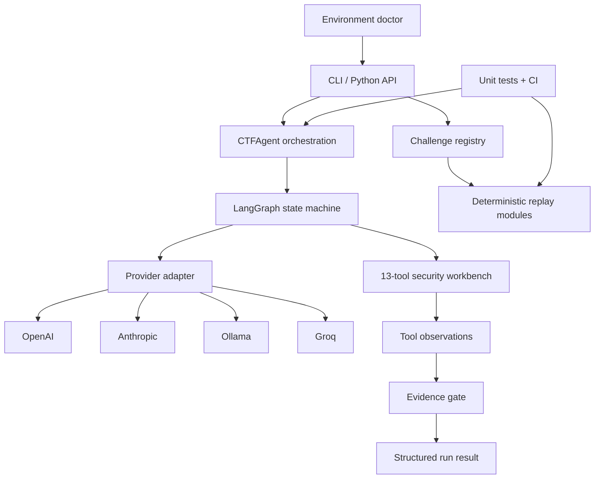
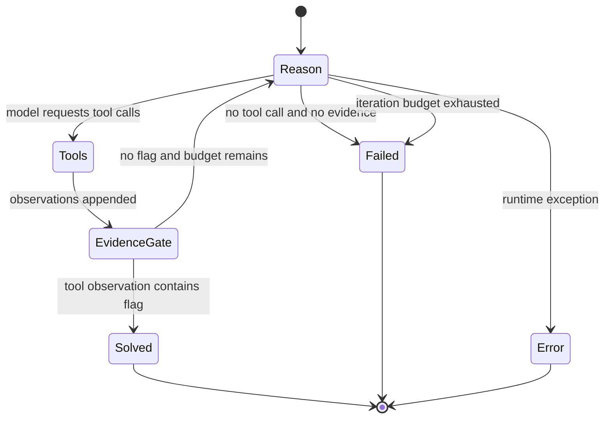

# OtomenTiga Agent Architecture

> Engineering design for the evidence-driven UCSI Agentic AI CTF harness.

## 1. Design objective

The harness turns a model into a bounded tool-using operator for authorized CTF challenges. It is designed around one non-negotiable rule:

> A model response is a proposal, not evidence. A solve is successful only when a flag appears in an executed tool observation.

The architecture supports two related workflows:

1. **Autonomous discovery** — an LLM selects tools and adapts to observations through a LangGraph state machine.
2. **Deterministic replay** — a challenge-specific module reruns a captured technique without an LLM.

Discovery provides flexibility. Replay provides repeatability. They deliberately have different operational contracts.

## 2. System context



### Main modules

| Module | Responsibility |
|---|---|
| `run.py` | Human and machine-readable CLI, argument handling, exit codes |
| `agent/core.py` | Graph state, reason/tool routing, evidence verification, structured result |
| `agent/llm.py` | Provider-specific model construction behind one interface |
| `agent/tools/` | LangChain-callable binary, code, network, web, and file tools |
| `agent/challenges.py` | Canonical capture metadata, aliases, and replay mapping |
| `agent/diagnostics.py` | No-network runtime and capability audit |
| `solvers/` | Captured challenge techniques as deterministic Python modules |
| `tests/` | Evidence, registry, CLI, failure, and executor contracts |

## 3. Agent state machine

### State contract

The graph carries this logical state:

| Field | Meaning |
|---|---|
| `messages` | Ordered system, human, model, and tool messages |
| `challenge` | Original challenge description |
| `category` | `pwn`, `web`, `rev`, `crypto`, or `misc` |
| `flags_found` | Unique flags extracted from tool observations |
| `iteration` | Number of model reasoning passes completed |
| `max_iterations` | Hard ceiling for model reasoning passes |
| `status` | `running`, `solved`, `failed`, or `error` |

### Transition model



`Reason` first inspects accumulated `ToolMessage` objects. If a tool has returned a valid flag, the graph completes immediately without spending another model call. Otherwise the model receives the history and may request one or more tools.

### Evidence gate

The evidence gate is implemented by `_tool_observed_flags()`:

- It examines `ToolMessage` instances only.
- It applies the competition flag pattern `UCSI26{...}`.
- It deduplicates repeated observations while preserving order.
- It ignores flag-shaped text emitted by the model.
- It prevents a model-only response from changing the run to `solved`.

This is an evidence-origin guarantee, not a cryptographic guarantee that the target is genuine. Operators should still preserve challenge output and use deterministic replay where possible.

## 4. Input and result contracts

Direct API and CLI solves validate:

- non-empty challenge text;
- a supported challenge category;
- host and port supplied together;
- port range `1..65535`;
- positive iteration limits; and
- existence of every supplied local challenge file.

A completed solve returns a dictionary suitable for JSON serialization:

```json
{
  "run_id": "3f9c6a20b7e1",
  "status": "solved",
  "flags": ["UCSI26{...}"],
  "evidence_source": "tool_observation",
  "iterations": 6,
  "category": "web",
  "provider": "openai",
  "model": "gpt-5.6-terra",
  "duration_seconds": 18.427
}
```

The CLI maps results to meaningful process codes:

| Code | Meaning |
|---:|---|
| `0` | Verified solve, successful replay, or successful diagnostic command |
| `1` | Run completed without verified evidence or encountered an execution failure |
| `2` | Invalid input, configuration error, unknown solver, or unavailable replay |

## 5. Tool workbench

### Binary analysis

- `analyze_binary`
- `list_functions`
- `get_strings`
- `checksec`

The Python wrappers depend on native tools such as radare2, GDB, binutils, or pwntools where applicable. `doctor` reports available native capabilities without treating all optional tools as core failures.

### Code execution

- `execute_python_code`
- `execute_script_file`

The default executor is a bounded local subprocess. It uses:

- the current virtual-environment interpreter via `sys.executable`;
- a unique temporary script for each generated-code call;
- a dedicated working directory;
- validated timeouts capped at 300 seconds;
- UTF-8 output with replacement for undecodable bytes;
- a 10,000-character observation limit;
- shell-free argument lists and quoted-argument parsing; and
- best-effort temporary-file cleanup.

This is not a hardened security boundary. `agent/sandbox.py` contains an experimental Docker component, but it is not connected to the default graph and is not represented as active isolation.

### Network and web

- `tcp_connect_and_interact`
- `http_request`
- `concurrent_requests`

These provide direct service interaction, HTTP session work, and race-condition testing. They must be used only against authorized targets.

### Files and transforms

- `read_file`
- `write_file`
- `hex_encode`
- `hex_decode`

These let the agent inspect artifacts, create exploit inputs, and move between raw and encoded forms.

## 6. Provider abstraction

`get_llm()` returns one LangChain-compatible chat model for four integrations:

| Provider | Integration | Intended use |
|---|---|---|
| OpenAI | `langchain-openai` | Cloud reasoning and tool use |
| Anthropic | `langchain-anthropic` | Cloud reasoning and tool use |
| Ollama | `langchain-ollama` | Local or self-hosted inference |
| Groq | `langchain-groq` | Hosted open-model inference |

The provider and model can come from `.env` or CLI overrides. The OpenAI GPT-5.6 profile enables the Responses API and medium reasoning effort; other providers receive their native adapter settings.

Provider integration packages are imported lazily. Deterministic replay and most diagnostics can therefore run without initializing a cloud model.

## 7. Capture and replay registry

`agent/challenges.py` is the single source of truth for the public competition portfolio. Each record contains:

- canonical slug and aliases;
- display name and category;
- exploit technique;
- captured flag; and
- optional replay module.

The registry currently describes nine captures. Eight resolve to importable solver modules. Helios Metadata Broker is marked as writeup evidence because a replay module is not present. The CLI refuses to present it as runnable.

Replay success requires the solver to return a string containing a valid flag. A known historical flag printed after a failed connection or missing asset is not accepted.

## 8. Diagnostics and CI

`python run.py doctor` performs a no-network audit of:

1. supported Python version;
2. required package imports;
3. configured provider integration and credentials;
4. replay-module imports;
5. optional native tools; and
6. bundled challenge artifacts.

`--strict` promotes optional warnings to a failing process status. `--json` produces a stable machine-readable payload.

GitHub Actions verifies Python 3.11 and 3.12 on every push and pull request:

1. install the bounded dependency set;
2. compile agent and solver modules;
3. run the unit-test suite; and
4. execute the environment doctor.

## 9. Failure model

| Failure | Behavior |
|---|---|
| Missing API key or provider package | Configuration error with a pointer to `doctor` |
| Unknown provider | Rejected before model execution |
| Missing challenge file | Rejected before graph execution |
| Model returns a flag without a tool observation | Claim ignored; run remains unsolved |
| Iteration limit reached | Clean `failed` result |
| Tool raises or model invocation fails | Clean `error` or failed process status |
| Replay target offline | Non-zero exit; no historical flag substituted |
| Replay asset missing | Non-zero exit; no success claim |

## 10. Extension rules

### Add a tool

1. Implement a focused, typed LangChain tool under `agent/tools/`.
2. Bound its runtime and output where external work is involved.
3. Return observation text that distinguishes output, errors, and exit status.
4. Register it once in `ALL_TOOLS`.
5. Add tests for normal, failure, and boundary behavior.

### Add a replay module

1. Implement `solve()` or `solve_remote()` under `solvers/`.
2. Return the observed flag on success and `None` on failure.
3. Never substitute a known flag when target evidence is unavailable.
4. Add the module to the canonical challenge registry.
5. Add an import and honest-failure test.

### Add a provider

1. Add a lazy provider builder in `agent/llm.py`.
2. Extend configuration validation and diagnostics.
3. Preserve the `BaseChatModel` and tool-calling contract.
4. Add its bounded dependency to `requirements.txt`.

## 11. Security boundary

The harness is an offensive-security research tool for CTFs and explicitly authorized environments. It does not implement target authorization on behalf of the operator. Local subprocess isolation, Docker availability, timeouts, and output limits reduce operational risk but do not make arbitrary exploit code safe. Run untrusted artifacts inside a dedicated disposable environment and apply normal network and credential isolation.
